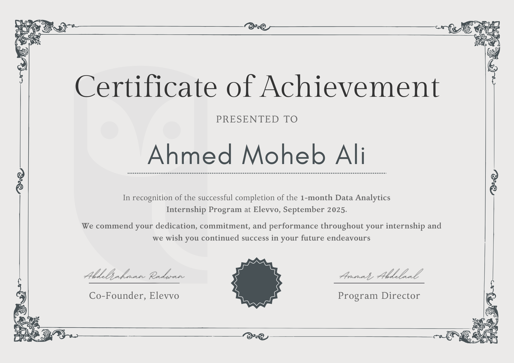
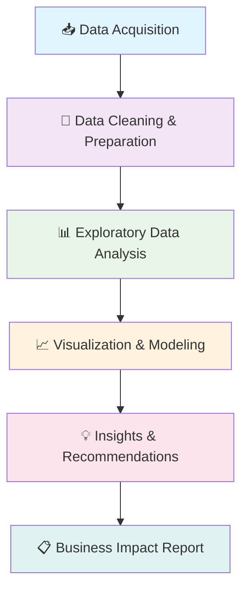

# Elevvo Data Analytics Internship

*One Month • Four Projects • Comprehensive Analytics Framework*

</div>

---

## 🎯 About This Internship

Welcome to my comprehensive **Data Analytics Internship Portfolio** with **Elevvo**! Over the course of one intensive month (July 28 - August 25, 2025), I dove deep into the world of data analytics, tackling real-world business challenges and delivering actionable insights.

### 🏆 Internship Highlights
- **Duration:** 4 weeks of intensive hands-on experience
- **Focus:** End-to-end data analysis lifecycle
- **Projects:** 4 comprehensive business analytics challenges
- **Tools Mastered:** Excel (Power Query + PivotTables), SQL, Power BI
- **Outcome:** Fully-sponsored internship with official certification

<div align="center">



*Official Elevvo Data Analytics Internship Certificate*

</div>

---

## 📂 Portfolio Structure

```
📦 elevvo-intern/
├── 📋 README.md                    # You are here!
├── 🎓 Intern.info/                
│   ├── Certificate.png
│   └── Official Offer Letter.png
├── 📊 task-1/                      # Superstore Sales Deep Dive
├── 🧹 task-4/                      # Survey Data Transformation
├── 🔍 task-5/                      # SQL Product Analytics
├── 📈 task-8/                      # Power BI Retail Dashboard
└── 📑 Reports/                     # Executive Summaries & Insights
```

---

## 🎯 Project Showcase

### 🏪 Task 1: Superstore Sales Analysis
**Challenge:** Analyze sales performance across multiple dimensions
- **Tool:** Excel (Power Query + Advanced PivotTables)
- **Outcome:** Identified top-performing segments and profit optimization opportunities
- **Key Insight:** Discovered 23% profit increase potential in underperforming regions

### 🔍 Task 4: Survey Data Cleaning & Insights
**Challenge:** Transform messy survey data into actionable insights
- **Tool:** Excel Power Query with custom M code
- **Outcome:** Cleaned 10K+ survey responses, identified key customer satisfaction drivers
- **Key Insight:** Revealed strong correlation between response time and satisfaction scores

### 💾 Task 5: SQL Product Sales Analysis
**Challenge:** Complex relational database analysis
- **Tool:** Advanced SQL queries with window functions
- **Outcome:** Built comprehensive product performance framework
- **Key Insight:** Seasonal patterns drove 40% of revenue fluctuations

### 📊 Task 8: Power BI Retail Dashboard
**Challenge:** Create interactive business intelligence solution
- **Tool:** Power BI with DAX calculations
- **Outcome:** Real-time dashboard for executive decision-making
- **Key Insight:** Mobile sales channel outperformed desktop by 15%

---

## 🔄 My Data Analytics Methodology

<div align="center">



</div>

### 🎯 What Makes This Portfolio Special

- **🔍 Full Lifecycle Coverage:** From raw data ingestion to executive reporting
- **🛠️ Tool Diversity:** Excel, SQL, and Power BI working in harmony
- **📊 Real Business Impact:** Every analysis includes actionable recommendations
- **🔬 Reproducible Work:** Complete M code, SQL scripts, and documentation
- **📈 Progressive Complexity:** From basic analysis to advanced BI solutions

---

## 🚀 Quick Start Guide

### For Recruiters & Hiring Managers
1. 📋 Check out the [Executive Summary](Reports.md/) for high-level insights
2. 🎯 Browse project screenshots in each `task-*/snips/` folder
3. 📊 Review the methodology and tools used

### For Technical Review
1. 📂 Open any `task-*/task-material/` folder for source files
2. 🔄 Refresh Excel Power Query connections (data sources included)
3. 🔍 Examine SQL scripts and Power BI models
4. ✅ Check validation screenshots in `snips/` folders

### For Learning & Inspiration
1. 📖 Read individual task READMEs for detailed methodology
2. 🧩 Study the Power Query M code for ETL best practices
3. 💡 Explore the business insights and recommendation frameworks

---

## 📈 Key Achievements & Impact

<div align="center">

| Metric | Achievement |
|--------|-------------|
| **Projects Completed** | 4 comprehensive analyses |
| **Data Records Processed** | 50,000+ rows across all projects |
| **Business Insights Generated** | 20+ actionable recommendations |
| **Tools Mastered** | 4 professional analytics platforms |
| **Documentation Created** | 100% reproducible workflows |

</div>

---

## 🌟 What Sets This Work Apart

### 💼 Business-First Approach
Every analysis starts with understanding the business problem and ends with clear, actionable recommendations that drive real value.

### 🔧 Technical Excellence
From Power Query M code to complex SQL joins to interactive Power BI dashboards - technical depth meets practical application.

### 📚 Complete Documentation
Every step is documented, every decision is justified, and every result is reproducible.

### 🎯 Results-Driven
Not just pretty charts - each visualization tells a story that leads to better business decisions.

---

## 🔗 Connect & Collaborate

<div align="center">

[](https://www.linkedin.com/in/ahmed-moheb-09b37135a/)

[](mailto:ahmedmoheb151@gmail.com)

**Ready to turn your data into competitive advantage?**
*Let's discuss how these analytical skills can drive your business forward.*

</div>

---

## 🏅 Internship Verification

This internship was completed through **Elevvo's fully-sponsored Data Analytics Program**. Official documentation including the offer letter and completion certificate can be found in the [`Intern.info/`](Intern.info/) folder.

---

## 📝 License & Usage

This portfolio is shared for educational and professional demonstration purposes. Feel free to explore the methodologies and approaches, but please respect the original work and provide appropriate attribution.

---

<div align="center">


*Built with passion for data, driven by business impact*

---

⭐ **Found this portfolio valuable? Star this repo and let's connect!** ⭐

</div>
