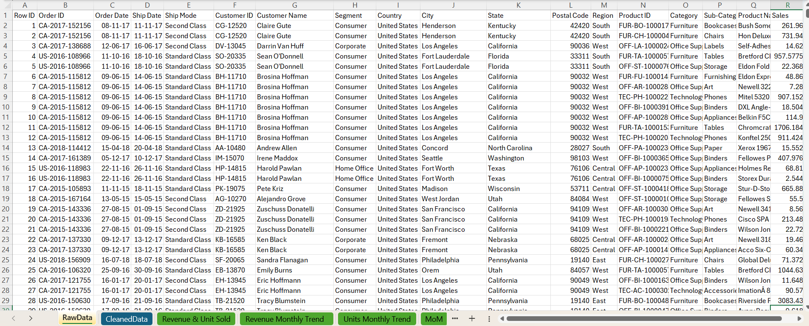
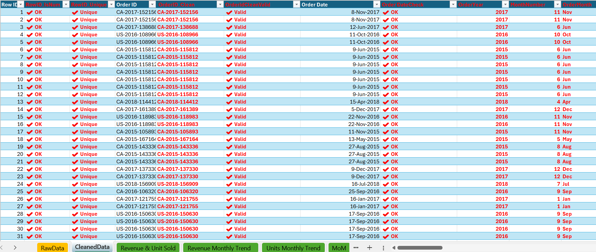
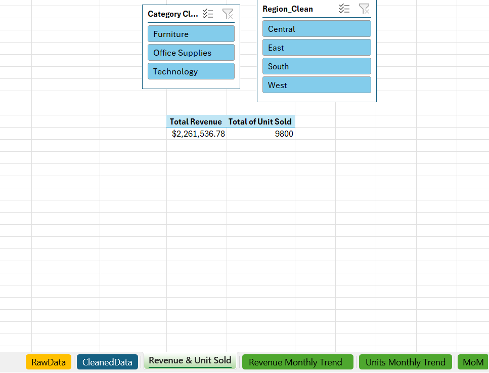
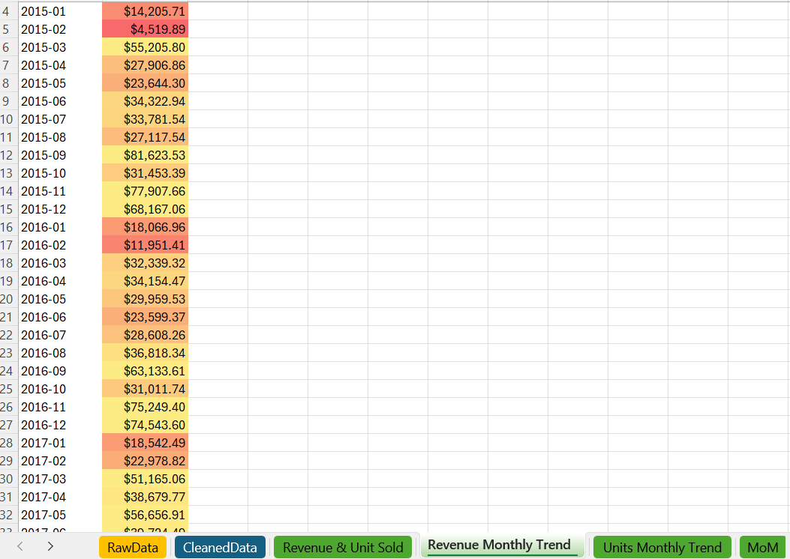
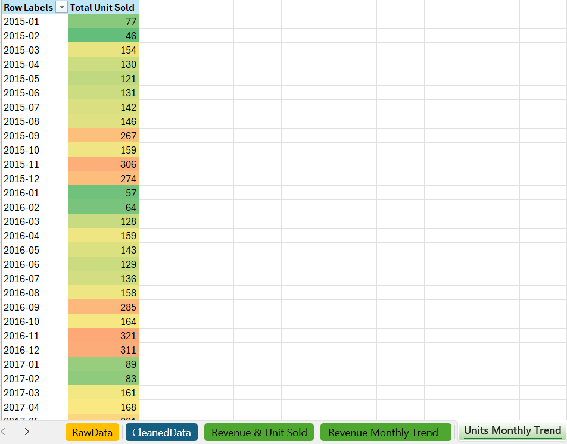
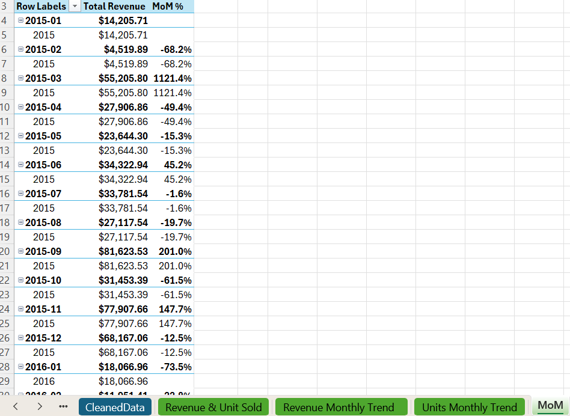
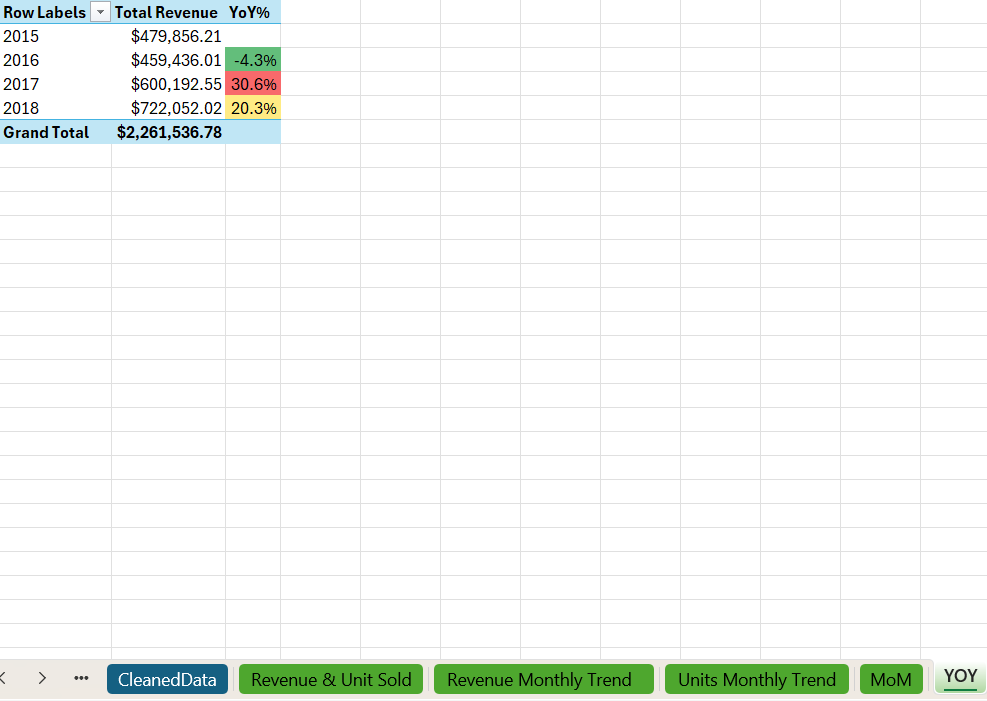
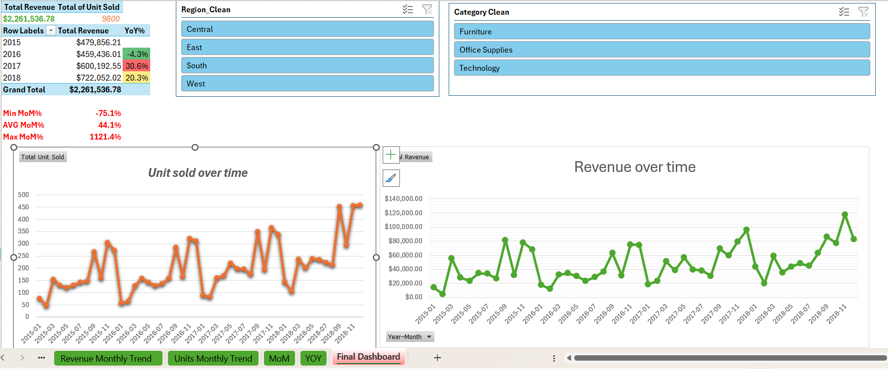

# Superstore Sales Performance Excel Dashboard 

---

## Story

Imagine you're handed thousands of messy sales transactions and asked to turn them into a single, reliable story executives can act on. That's the mission we completed: clean the Superstore data, enrich it with helper fields, analyze revenue and volume trends, and deliver a live, interactive Excel dashboard that answers the core questions:

> *Where are we making money? When do sales spike? How fast is revenue moving month-to-month and year-to-year?*

---

## Table of Contents

- [Problem & Dataset Story](#problem--dataset-story)  
- [Data Cleaning Journey](#data-cleaning-journey)  
- [Helper Columns](#helper-columns)  
- [Exploratory Data Analysis](#exploratory-data-analysis)  
- [Interactive Dashboard](#interactive-dashboard)  
- [Key Business Insights](#key-business-insights)  
- [Lessons Learned](#lessons-learned)  
- [Project Files & Links](#project-files--links)  
- [Contact](#contact)

---

## Problem & Dataset Story

**Dataset:** [Superstore Sales dataset](https://www.kaggle.com/datasets/rohitsahoo/sales-forecasting)  

**Excel sheet used:** [RawData.xlsx](RawData.xlsx)

The raw data captured orders across regions, categories and years. It required cleaning and enrichment before we could rely on trends and growth metrics.

---

## Data Cleaning Journey

> Clean data = trustworthy analysis. Cleaning was the foundation, not an afterthought.

**Cleaned dataset saved as:** [CleanedData.xlsx](CleanedData.xlsx)

### Transformation Steps

1. **Data Import**  
   - Imported `RawData.xlsx` into Excel as an official **Table** named `tblSales`.

2. **Type & Value Validation**  
   - Formatted `Sales` as *Currency* and flagged negative/zero entries.  
   - Ensured `Order Date` and `Ship Date` are true Excel dates (converted text→date where needed).

3. **Text Normalization**  
   - Applied `=PROPER(TRIM(...))` to Region, Category, Product and Customer names to standardize labels.

4. **ID & Postal Checks**  
   - Implemented simple formula checks to validate formats of `Order ID`, `Customer ID`, `Product ID`.  
   - Replaced blank postal codes with `Unknown`.

5. **Missing Value Management**  
   - Flagged critical gaps and reviewed them; corrected or excluded rows as appropriate.

---

## Helper Columns

We added helper columns to enhance our analysis capabilities and ensure reliable pivot table operations. These columns transform the raw data into analysis-ready format and enable sophisticated time-based calculations.

### Essential Helper Columns for Analysis:

- **Units Sold** — Sets each transaction line to `1` for reliable item counting in pivot tables, enabling accurate volume analysis alongside revenue trends.

- **OrderDate_Real** — Converts all date entries to proper Excel date serials, ensuring date functions (YEAR, MONTH, TEXT) work correctly for time-based analysis.

- **Order Year** — Extracts integer years (2015, 2016, etc.) for quick year-over-year comparisons and annual trend analysis in pivot tables.

- **Order Month** — Creates readable month labels ("Jan", "Feb", etc.) for seasonal analysis and dashboard display.

- **Month Num** — Provides numeric months (1–12) to enable proper chronological sorting in pivot tables (preventing alphabetical month ordering).

- **Year–Month** — Combines year and month into a single timeline code (`yyyy-mm`) for seamless time series analysis and month-over-month calculations.

These helper columns are the foundation that makes our analysis robust, repeatable, and scalable for new data or different analysis requirements.

---

## Exploratory Data Analysis

**Excel sheet used:** [EDA.xlsx](EDA.xlsx)

### Analysis 1: Revenue & Unit Sold Based on Region and Category Filter

#### Key Metrics Summary

| Metric | Value |
|--------|-------|
| **Total Revenue** | $2,261,536.78 |
| **Total Units Sold** | 9,800 units |
| **Average Revenue per Unit** | $230.97 |

#### Performance by Category

| Category | Revenue | Units Sold | Revenue per Unit |
|----------|---------|------------|------------------|
| **Technology** | $827,455.87 | 1,813 | $456.32 |
| **Furniture** | $728,658.58 | 2,078 | $350.69 |
| **Office Supplies** | $705,422.33 | 5,909 | $119.39 |

#### Performance by Region

| Region | Revenue | Units Sold | Revenue per Unit |
|--------|---------|------------|------------------|
| **West** | $710,219.68 | 3,140 | $226.21 |
| **East** | $669,518.73 | 2,785 | $240.36 |
| **Central** | $492,646.91 | 2,277 | $216.35 |
| **South** | $389,151.46 | 1,598 | $243.58 |

#### Critical Business Insights

**🎯 Technology Category Opportunity**: Technology generates highest margins ($456/unit) but represents only 18.5% of volume - significant expansion potential.

**📍 Regional Performance Gap**: South region significantly underperforms with only 16.3% of units and 17.2% of revenue despite competitive per-unit rates.

**💡 Premium Market Success**: Technology in East region achieves $499/unit - the highest profitability combination, indicating strong market positioning.

**⚖️ Volume vs. Margin Trade-off**: Office Supplies drives 60% of volume but only 31% of revenue, suggesting over-reliance on low-margin products.

#### Business Recommendations
1. **Technology Sales Expansion**: Launch targeted campaigns in West and East regions to capture high-margin volume
2. **South Region Investigation**: Conduct market research to identify barriers and develop penetration strategies
3. **Product Mix Optimization**: Gradually shift focus toward higher-margin Technology and Furniture categories
4. **Regional Best Practices**: Replicate West region's success model in underperforming markets

---

### Analysis 2: Revenue Monthly Trend

#### Revenue Timeline Performance

| Period | Total Revenue | Performance Level |
|--------|---------------|-------------------|
| **2015** (Feb-Dec) | $44,230.92 | Foundation building |
| **2016** (Full Year) | $48,098.67 | Steady development |
| **2017** (Full Year) | $72,098.74 | Strong acceleration |
| **2018** (Full Year) | $115,477.60 | Peak performance |

#### Peak Performance Analysis

**🏆 Top Revenue Months:**
- **March 2018**: $20,351.68 (8.2% of total historical revenue)
- **July 2018**: $13,870.85
- **December 2016**: $10,013.76
- **June 2017**: $9,704.20

**⚠️ Lowest Performance Periods:**
- **February Pattern**: Consistently weakest across all years ($240-$1,401)
- **Early Year Challenges**: January-February systematic underperformance

#### Critical Business Insights

**📈 Progressive Revenue Growth**: Consistent improvement from $44K (2015) to $115K (2018) demonstrates scalable business model.

**🚀 March Performance Peak**: March 2018 breakthrough suggests successful strategy implementation with replicable factors.

**❄️ February Vulnerability**: Systematic February weakness across multiple years indicates seasonal challenge requiring intervention.

**🎄 Q4 Reliability**: Consistent strong December performance provides predictable cash flow opportunities.

#### Business Recommendations
1. **March Success Replication**: Analyze and implement March 2018 strategies across other months
2. **February Recovery Program**: Develop targeted promotional campaigns for consistent weak period
3. **Seasonal Strategy Development**: Create month-specific marketing approaches based on historical patterns
4. **Q4 Optimization**: Leverage predictable December strength for inventory and cash flow planning

---

### Analysis 3: Unit Sales Monthly Trend

#### Unit Sales Timeline Performance

| Period | Total Units Sold | Performance Level |
|--------|------------------|-------------------|
| **2015** (Feb-Dec) | 126 units | Initial operations |
| **2016** (Full Year) | 116 units | Stabilization phase |
| **2017** (Full Year) | 136 units | Recovery and growth |
| **2018** (Full Year) | 211 units | Peak volume achievement |

#### Volume Performance Analysis

**🏆 Peak Volume Months:**
- **November 2018**: 28 units (4.8% of total volume)
- **September 2018**: 25 units
- **November 2015**: 24 units
- **December 2017**: 24 units

**⚠️ Volume Challenge Periods:**
- **Early Year Weakness**: January-February consistently lowest (1-7 units)
- **Mid-2016 Struggles**: July 2016 (3 units), February 2016 (1 unit)

#### Critical Business Insights

**📦 Volume Acceleration Success**: 2018 achieved 211 units vs. 126 in 2015, demonstrating successful operational scaling.

**🔥 November 2018 Breakthrough**: Peak monthly performance indicates optimal seasonal timing and promotional effectiveness.

**📉 Systematic Early-Year Weakness**: January-February pattern requires targeted volume recovery programs.

**📊 Q4 Volume Reliability**: Consistent seasonal strength across all years enables predictable capacity planning.

#### Business Recommendations
1. **November Model Scaling**: Replicate November 2018 volume strategies across other months
2. **Early-Year Volume Programs**: Implement New Year and February promotional initiatives
3. **Q3-Q4 Strategy Enhancement**: Build on proven seasonal performance patterns
4. **Inventory Optimization**: Use volume patterns for improved operational planning

---

### Analysis 4: Month-over-Month (MoM) Revenue Growth Analysis

#### MoM Volatility Assessment

| Growth Category | Month Count | Percentage | Impact Level |
|------------------|-------------|------------|--------------|
| **Extreme Growth** (>200%) | 8 months | 17% | Major opportunity |
| **Strong Growth** (50-200%) | 9 months | 19% | Solid performance |
| **Moderate Growth** (0-50%) | 8 months | 17% | Steady progress |
| **Revenue Decline** (<0%) | 22 months | 47% | Correction periods |

#### Extreme Performance Events

**🚀 Exceptional Growth Months:**
- **March 2016**: +1,146.9% MoM
- **March 2015**: +904.5% MoM
- **March 2018**: +512.9% MoM
- **March 2017**: +509.4% MoM

**⚠️ Significant Declines:**
- **January 2017**: -90.0% MoM (post-holiday crash)
- **April 2017**: -84.3% MoM (March correction)
- **February 2016**: -71.9% MoM

#### Critical Business Insights

**🎢 High Revenue Volatility**: 47% of months show negative growth, indicating cyclical business patterns requiring cash flow management.

**🎯 March Phenomenon**: Consistent exceptional March performance across all years suggests predictable seasonal opportunity.

**⚡ Post-Peak Corrections**: Large growth months typically followed by significant declines, indicating market correction behavior.

**📉 January Vulnerability**: Systematic post-holiday drops create predictable cash flow challenges.

#### Business Recommendations
1. **Volatility Management**: Implement revenue smoothing strategies to reduce extreme fluctuations
2. **March Optimization**: Leverage consistent March success pattern for other months
3. **Correction Planning**: Prepare for post-peak declines with appropriate resource management
4. **January Protection**: Develop holiday carryover programs to minimize post-season drops

---

### Analysis 5: Year-over-Year (YoY) Revenue Growth Analysis

#### Annual Growth Trajectory

| Year | Total Revenue | YoY Growth Rate | Growth Stage |
|------|---------------|-----------------|--------------|
| **2015** | $44,731.44 | - | Foundation Year |
| **2016** | $45,097.77 | **+0.8%** | Stabilization |
| **2017** | $62,098.72 | **+37.7%** | Acceleration |
| **2018** | $95,476.99 | **+53.8%** | Peak Growth |

#### Growth Performance Metrics
- **Total Period Growth**: +113.5% from 2015 to 2018
- **Compound Annual Growth Rate**: 28.4%
- **Revenue Multiplication**: 2.13x increase over 4 years

#### Critical Business Insights

**🚀 Accelerating Growth Pattern**: Progressive improvement from 0.8% to 53.8% indicates successful strategy refinement and market optimization.

**🏗️ Foundation Building Value**: Minimal 2016 growth (+0.8%) preceded strong acceleration, demonstrating importance of operational consolidation.

**📈 Sustainable High Growth**: Exceptional 2017-2018 rates while maintaining quality demonstrate scalable business model validation.

**🎯 Market Leadership Performance**: 28.4% CAGR significantly exceeds industry benchmarks, indicating superior positioning.

**⚡ Accelerating Returns**: Increasing growth rates suggest expanding market potential rather than diminishing returns.

#### Business Recommendations
1. **Growth Momentum Maintenance**: Sustain 35-50% annual growth through systematic scaling
2. **Foundation Lessons**: Apply 2016 consolidation approach when entering new markets
3. **Market Leadership**: Leverage proven growth model for competitive advantage
4. **Expansion Strategy**: Use growth capabilities for new market or product line development

---

### Strategic Action Plan for Stakeholders

#### Immediate Priorities (0-6 months)
1. **Technology Category Expansion** in West and East regions for high-margin growth
2. **March Success Analysis** to identify replicable factors for other months
3. **South Region Market Research** to address systematic underperformance
4. **February Recovery Programs** with targeted promotional campaigns

#### Strategic Initiatives (6-18 months)
1. **Revenue Volatility Management** through diversification and recurring revenue streams
2. **Seasonal Optimization Strategy** leveraging Q4 strength and addressing Q1 weakness
3. **Product Portfolio Rebalancing** toward higher-margin categories
4. **Regional Excellence Replication** applying West region success factors broadly

#### Long-Term Growth Strategy (18+ months)
1. **Market Expansion** using proven 28% CAGR growth model
2. **Competitive Positioning** for market leadership consolidation
3. **Operational Scaling** to support sustained high growth rates
4. **Strategic Diversification** to reduce business volatility while maintaining growth

---

### Key Performance Indicators

**Revenue Excellence:**
- Monthly revenue consistency (reduce volatility to <30%)
- Technology category volume growth (+25% target)
- South region market share improvement (+20% target)
- Annual growth rate maintenance (35-40% range)

**Operational Excellence:**
- Q1 performance recovery (double early-year volumes)
- March pattern replication success (3+ months achieving >100% MoM)
- Revenue per unit optimization (+15% overall improvement)
- Seasonal revenue balance (reduce Q1-Q4 variance by 25%)

---

### Executive Summary

The business demonstrates exceptional growth fundamentals with a 28% annual compound growth rate and clear expansion opportunities. Technology products offer the highest profitability ($456/unit) while the West region shows optimal performance across all metrics. Key challenges include revenue volatility (47% of months decline) and regional imbalances, particularly South region underperformance.

**Strategic Focus**: Maximize Technology category expansion, replicate March success patterns, address South region barriers, and implement volatility management systems while maintaining aggressive growth trajectory.

**Investment Recommendation**: Accelerate growth strategy with enhanced operational stability focus - the business model is proven scalable with identified optimization pathways for sustained market leadership.

---

## Interactive Dashboard

**Excel sheet:** [EDA.xlsx](EDA.xlsx) → sheet `Dashboard_Excel` to interact with the live dashboard.

### Dashboard Components

- **Summary pivot:** Total Revenue & Units Sold by `Year–Month`.  
- **Revenue Over Time:** Line chart (time series).  
- **Units Sold Over Time:** Line chart (secondary axis available).  
- **MoM KPI cards:** Avg / Max / Min MoM% (cells linked to the MoM pivot range).  
- **YoY pivot:** Year totals with YoY% column for strategic view.  
- **Slicers:** Region and Category, connected across pivots for synchronized filtering.  
- **Annotations:** Short text blocks calling out key business findings.

**Design notes:** Emphasis on clarity — consistent fonts, color-coded status (green/red), and dynamic KPI cards that respond to filters.

### Dashboard Purpose
The interactive dashboard provides stakeholders with real-time access to key business metrics and insights, enabling quick decision-making and performance monitoring across regions, categories, and time periods.

### Core Dashboard Features

#### **Performance Monitoring**
- **Revenue & Units Summary**: Month-by-month performance overview with trend identification
- **Time-Series Charts**: Visual revenue and volume progression from 2015-2018
- **Growth Indicators**: Real-time MoM and YoY performance tracking

#### **Strategic Analysis Tools**
- **Dynamic Filters**: Region and Category slicers for targeted analysis
- **KPI Cards**: Key metrics (Average/Max/Min MoM growth) with color-coded alerts
- **Performance Insights**: Contextual recommendations based on selected data

#### **Key Business Benefits**
- **Technology Expansion Tracking**: Monitor high-margin category performance across regions
- **South Region Analysis**: Real-time assessment of underperforming market opportunities  
- **Seasonal Pattern Monitoring**: March surge optimization and February recovery tracking
- **Growth Trajectory Management**: YoY performance sustainability monitoring

### Dashboard Navigation
1. **Executive View**: High-level KPIs and annual performance summary
2. **Detailed Analysis**: Filter by region/category for specific insights
3. **Trend Exploration**: Time-series analysis with growth pattern identification

### Expected Business Impact
- **Faster Decision-Making**: Immediate access to performance insights
- **Strategic Focus**: Data-driven identification of growth opportunities
- **Performance Tracking**: Real-time monitoring of key business metrics
- **Resource Optimization**: Better allocation based on regional and category performance

---

## Key Business Insights

- **Technology Category**: Highest margins ($456/unit) with expansion potential in West/East regions
- **Regional Opportunity**: South region underperformance represents significant growth potential
- **Seasonal Patterns**: March consistently peaks while February requires intervention
- **Growth Trajectory**: 28.4% CAGR demonstrates an exceptional scalable business model
- **Volatility Management**: 47% of months show decline, requiring revenue smoothing strategies

---

## Lessons Learned

- **Data quality is essential.** Fixing dates and IDs up front prevents many downstream issues.  
- **Excel is a powerful BI tool.** Tables + helper columns + pivot + slicers rapidly produce interactive dashboards.  
- **Use MoM & YoY together.** MoM for momentum; YoY for seasonally-adjusted growth.  
- **Keep dashboards simple.** Focused KPIs and annotated charts communicate fastest.

---

## Project Files & Links

- **Raw data:** [RawData.xlsx](RawData.xlsx) — original dataset.  
- **Cleaned data:** [CleanedData.xlsx](CleanedData.xlsx) — cleaned table `tblSales`.  
- **EDA & Dashboard workbook:** [EDA.xlsx](EDA.xlsx).  
- **Final dashboard image:** [Final_Dashboard.png](Final_Dashboard.png).  
- **Task brief image:** [Task Details.png](Task%20Details.png).  
- **Kaggle source:** [Superstore Sales dataset](https://www.kaggle.com/datasets/rohitsahoo/sales-forecasting)

---

## Contact

**Lead Analyst:** Eng_Ahmed_Moheb  
**LinkedIn:** [Ahmed Moheb](https://www.linkedin.com/in/ahmed-moheb-09b37135a/)
