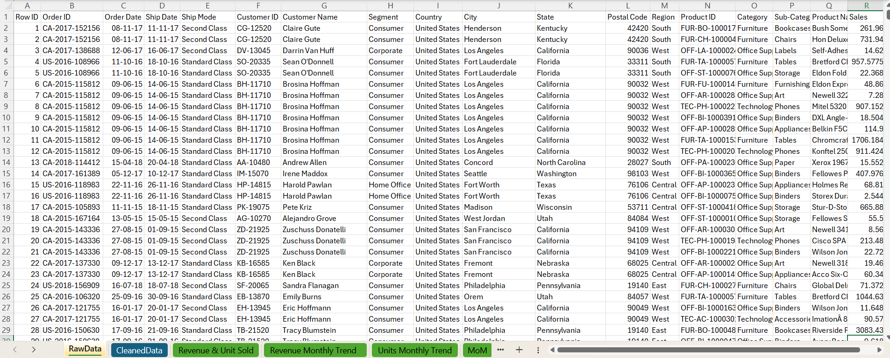
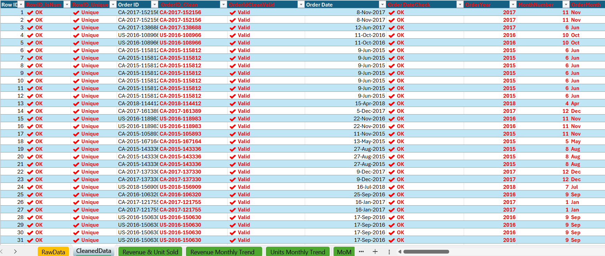
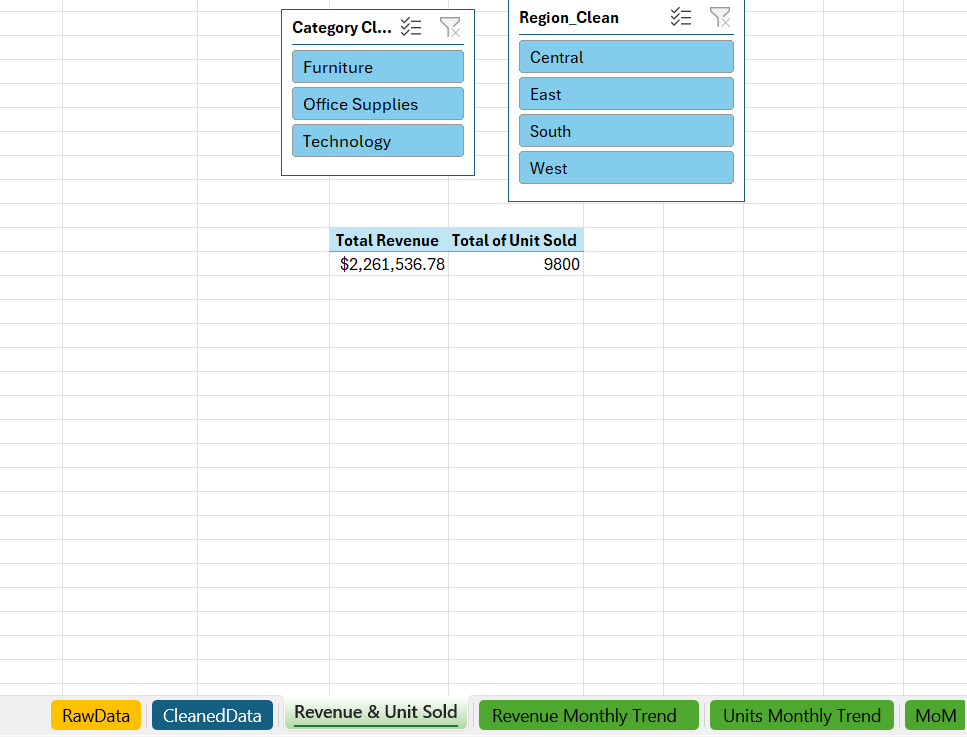
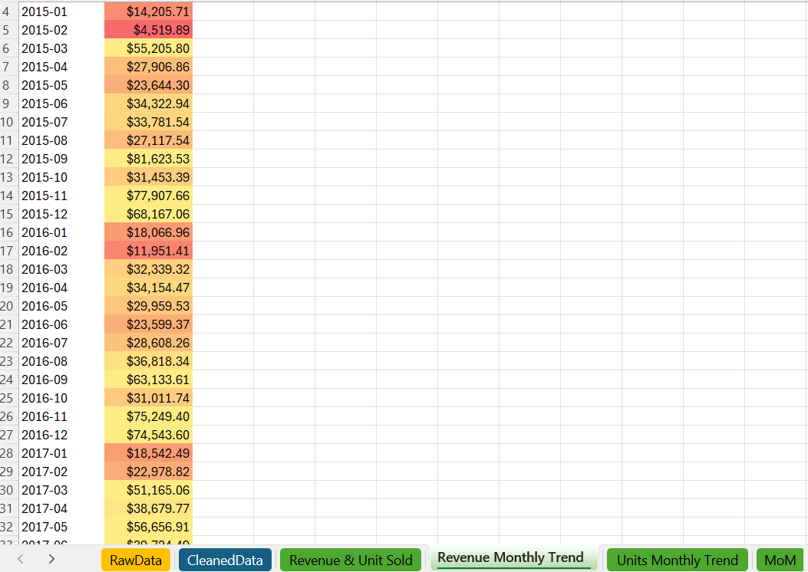
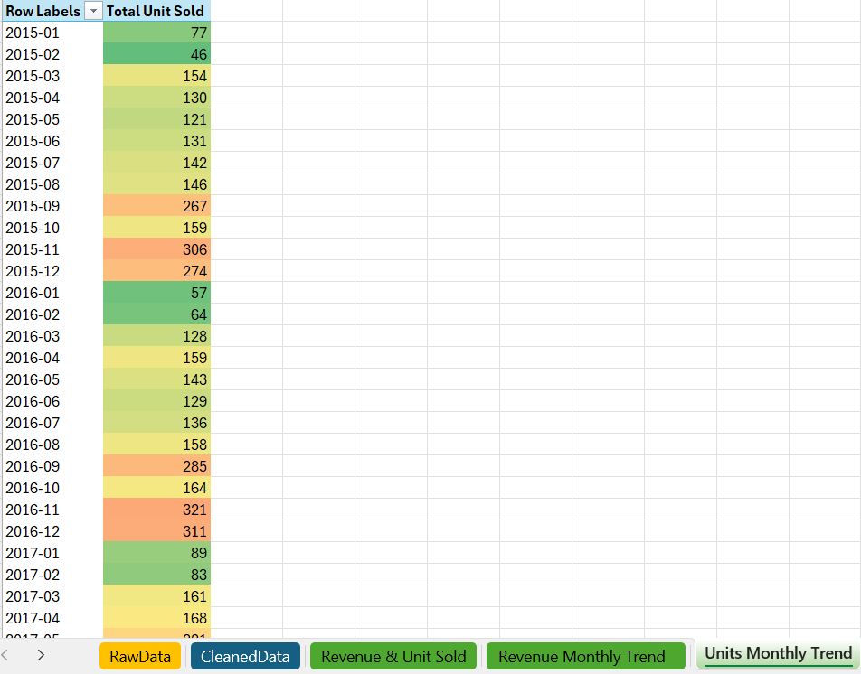
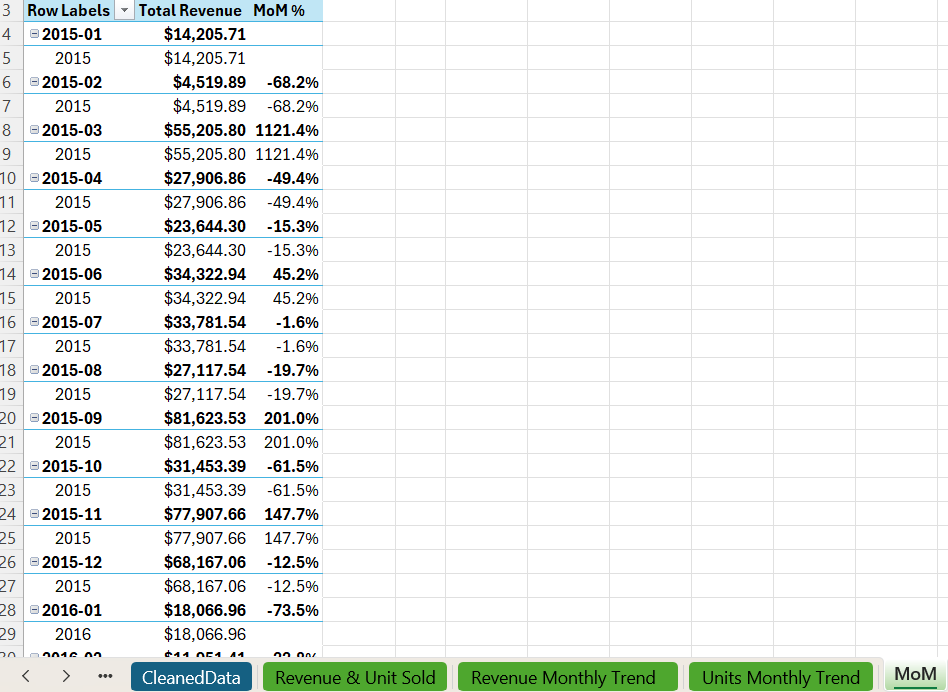
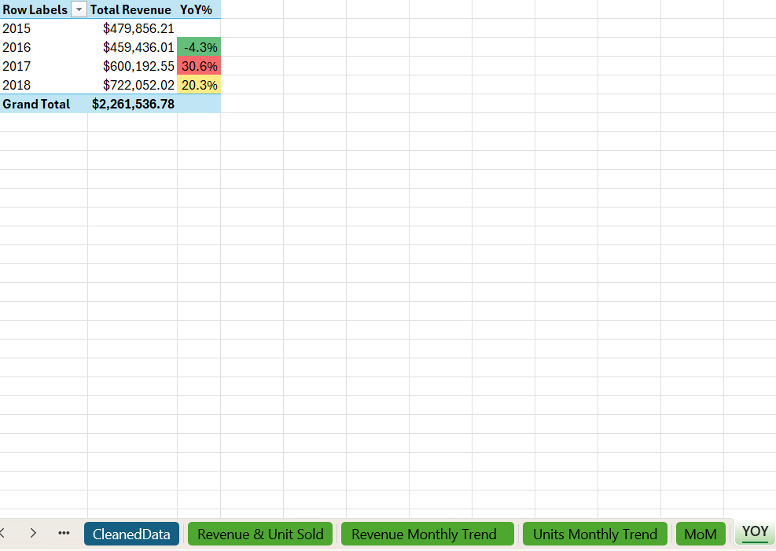
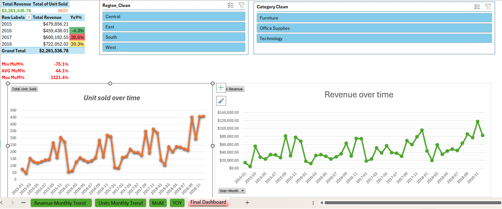

# Superstore Sales Performance Analysis & Trends ( Excel )     

---

## Story

Imagine you're handed thousands of messy sales transactions and asked to turn them into a single, reliable story executives can act on. That's the mission we completed: clean the Superstore data, enrich it with helper fields, analyze revenue and volume trends, and deliver a live, interactive Excel dashboard that answers the core questions:

> *Where are we making money? When do sales spike? How fast is revenue moving month-to-month and year-to-year?*

---

## Table of Contents

- [Problem & Dataset Story](#problem--dataset-story)  
- [Data Cleaning Journey](#data-cleaning-journey)  
- [Helper Columns](#helper-columns)  
- [Exploratory Data Analysis](#exploratory-data-analysis)  
- [Interactive Dashboard](#interactive-dashboard)  
- [Lessons Learned](#lessons-learned)   
- [Contact](#contact)

---

## Problem & Dataset Story

**Dataset:** [Superstore Sales dataset](https://www.kaggle.com/datasets/rohitsahoo/sales-forecasting)  

**Excel sheet used:** [RawData.xlsx](RawData.xlsx)

The raw data captured orders across regions, categories and years. It required cleaning and enrichment before we could rely on trends and growth metrics.

---

## Data Cleaning Journey

> Cleaning was the foundation, not an afterthought.

**Cleaned dataset saved as:** [CleanedData.xlsx](CleanedData.xlsx)

### Transformation Steps

1. **Data Import**  
   - Imported `RawData.xlsx` into Excel as an official **Table** named `tblSales`.

2. **Type & Value Validation**  
   - Formatted `Sales` as *Currency* and flagged negative/zero entries.  
   - Ensured `Order Date` and `Ship Date` are true Excel dates (converted text→date where needed).

3. **Text Normalization**  
   - Applied `=PROPER(TRIM(...))` to Region, Category, Product and Customer names to standardize labels.

4. **ID & Postal Checks**  
   - Implemented simple formula checks to validate formats of `Order ID`, `Customer ID`, `Product ID`.  
   - Replaced blank postal codes with `Unknown`.

5. **Missing Value Management**  
   - Flagged critical gaps and reviewed them; corrected or excluded rows as appropriate.

---

## Helper Columns

We added helper columns to enhance our analysis capabilities and ensure reliable pivot table operations. These columns transform the raw data into an analysis-ready format.

### Essential Helper Columns for Analysis:

- **Units Sold** — Sets each transaction line to `1` for reliable item counting in pivot tables, enabling accurate volume analysis alongside revenue trends.

- **OrderDate** — Converts all date entries to proper Excel date serials, ensuring date functions (YEAR, MONTH, TEXT) work correctly for time-based analysis.

- **Order Year** — Extracts integer years (2015, 2016, etc.) for quick year-over-year comparisons and annual trend analysis in pivot tables.

- **Order Month** — Creates readable month labels ("Jan", "Feb", etc.) for seasonal analysis and dashboard display.

- **Month Num** — Provides numeric months (1–12) to enable proper chronological sorting in pivot tables (preventing alphabetical month ordering).

- **Year–Month** — Combines year and month into a single timeline code (`yyyy-mm`) for seamless time series analysis and month-over-month calculations.
  
---

## Exploratory Data Analysis

**Excel sheet used:** [EDA.xlsx](EDA.xlsx)

### Analysis 1: Revenue & Unit Sold Based on Region &  Category Filter

#### Key Metrics Summary

| Metric | Value |
|--------|-------|
| **Total Revenue** | $2,261,537 |
| **Total Units Sold** | 9,800 units |
| **Average Revenue per Unit** | $230.77 |

#### Performance by Category

| Category | Revenue | Units Sold | Revenue per Unit |
|----------|---------|------------|------------------|
| **Technology** | $827,456 | 1,813 | $456.40 |
| **Furniture** | $728,659 | 2,078 | $350.65 |
| **Office Supplies** | $705,422 | 5,909 | $119.38 |

#### Performance by Region

| Region | Revenue | Units Sold | Revenue per Unit |
|--------|---------|------------|------------------|
| **West** | $710,220 | 3,140 | $226.18 |
| **East** | $669,519 | 2,785 | $240.40 |
| **Central** | $492,647 | 2,277 | $216.36 |
| **South** | $389,151 | 1,598 | $243.52 |

### Category-Region Performance Matrix

| Category | Region | Revenue | Units Sold | Revenue per Unit |
|----------|--------|---------|------------|------------------|
| Technology | East | $263,117 | 527 | $499.27 |
| Technology | West | $247,405 | 589 | $420.04 |
| Technology | Central | $168,739 | 408 | $413.58 |
| Technology | South | $148,195 | 289 | **$512.79** |
| Furniture | West | $245,348 | 691 | $355.06 |
| Furniture | East | $206,461 | 591 | $349.34 |
| Furniture | Central | $160,317 | 470 | $341.1 |
| Furniture | South | $116,531 | 326 | $357.46 |
| Office Supplies | West | $217,467 | 1,860 | $116.92 |
| Office Supplies | East | $199,941 | 1,667 | $119.94 |
| Office Supplies | Central | $163,590 | 1,399 | $116.93 |
| Office Supplies | South | $124,425 | 983 | **$126.58** |

#### Critical Business Insights

**🎯 Technology Category Opportunity**: Technology generates the highest margins ($456/unit) but represents only 18.5% of volume - significant expansion potential.

**📍 Regional Performance Gap**: South region significantly underperforms with only 16.3% of units and 17.2% of revenue despite competitive per-unit rates.

**⚖️ Volume vs. Margin Trade-off**: Office Supplies drives 60% of volume but only 31% of revenue, suggesting over-reliance on low-margin products.

**💡 Premium Market Success**: Technology in the East region achieves $499/unit - the highest profitability combination, indicating strong market positioning.

  **🌟 West Region Market Leadership**: The West region dominates both volume (32% of units) and revenue (31% of total), suggesting successful market strategies that could be replicated in other regions.

 **⚡Technology-South Premium Pricing**: Technology products in the South region command the highest revenue per unit ($512.78), indicating strong market demand but limited volume penetration.

#### Business Recommendations
1. **Technology Sales Acceleration Program**
   - Launch targeted marketing campaigns in the West and East regions to increase Technology category volume
   - Implement sales incentives for Technology products
   - **Expected Impact:** 15-20% increase in Technology units sold

2. **South Region Market Penetration Strategy**
   - Conduct market research to identify barriers in South region
   - Develop region-specific promotional campaigns
   - Consider strategic partnerships or distribution channel expansion
   - **Expected Impact:** 25% increase in South region sales volume

3.**Portfolio Optimization Strategy**
   - Gradually shift product mix toward higher-margin categories (Technology/Furniture)
   - Introduce premium Office Supplies lines to improve category margins
   - **Expected Impact:** 10-15% improvement in overall profit margins

4.**Best Practice Replication Program**
   - Analyze West region's success factors and implement in Central and South regions
   - Cross-regional knowledge sharing and training programs
   - **Expected Impact:** 20% revenue increase in underperforming regions

## Success Metrics to Monitor

- **Revenue per Unit** by category and region
- **Market Share Growth** in South region
- **Technology Category Volume Growth** across all regions
- **Overall Profit Margin Improvement**
- **Regional Revenue Distribution Balance**
---

### Analysis 2: Revenue Monthly Trend

# Revenue Timeline Performance

| Period | Total Revenue | Performance Level |
|--------|---------------|-------------------|
| 2015 (Full Year) | $469,076 | Foundation building |
| 2016 (Full Year) | $569,435 | Steady development |
| 2017 (Full Year) | $648,240 | Growth consolidation |
| 2018 (Full Year) | $574,786 | Peak performance bursts |

## Peak Performance Analysis

### 🏆 Top Revenue Months

1. **November 2018** – $117,938 (5.2% of total historical revenue)
2. **December 2017** – $95,739
3. **September 2018** – $86,153
4. **December 2018** – $83,030
5. **September 2015** – $81,624

### ⚠️ Lowest Performance Periods

* **February 2015** – $4,520 (lowest month on record)
* **February 2016** – $11,951
* **January 2015** – $14,206
* **January 2016** – $18,067
* **January 2017** – $18,542

## Critical Business Insights

📈 **Q4 Powerhouse** – November and December dominate the leaderboard, with November 2018 setting the all-time record.

🚀 **Late-Year Surges** – The top five months are all in Q3 or Q4, suggesting strong seasonal demand cycles.

📉 **Early-Year Weakness** – January and February consistently underperform, indicating a recurring seasonal dip.

🔄 **2017 as a Standout Year** – Highest annual total, driven by a strong Q4 and balanced performance across other months.

## Business Recommendations

1. **Double Down on Q4** – Allocate more marketing spend and inventory to November–December to maximize proven demand.
2. **Counter Early-Year Slump** – Launch targeted campaigns in January–February to smooth revenue volatility.
3. **Replicate September & November Wins** – Analyze these months for repeatable promotional or operational strategies.
4. **Diversify Seasonal Peaks** – Explore opportunities to create mid-year demand spikes to reduce reliance on Q4.
---

### Analysis 3: Unit Sales Monthly Trend

# Unit Sales Timeline Performance

| Period | Total Units Sold | Performance Level |
|--------|------------------|-------------------|
| **2015** (Full Year) | **1,776 units** | Initial operations |
| **2016** (Full Year) | **1,985 units** | Stabilization phase |
| **2017** (Full Year) | **2,435 units** | Recovery and growth |
| **2018** (Full Year) | **3,604 units** | Peak volume achievement |

## Volume Performance Analysis

### 🏆 Peak Volume Months:

* **December 2018**: 459 units (**4.7%** of total volume)
* **November 2018**: 456 units
* **September 2018**: 453 units
* **November 2017**: 366 units

### ⚠️ Volume Challenge Periods:

* **Early-Year Weakness**: January–February remain the lowest months (e.g., Feb 2015: 46 units, Feb 2016: 64 units, Feb 2018: 104 units)
* **Mid-2016 Struggles**: July 2016 (136 units), February 2016 (64 units)

## Critical Business Insights

**📦 Volume Acceleration Success** 2018 achieved **3,604 units** vs. **1,776 units** in 2015 — more than doubling output, confirming strong operational scaling.

**🔥 Q4 2018 Breakthrough** Three of the top four months in the entire dataset occurred in Q4 2018, showing exceptional seasonal and promotional execution.

**📉 Persistent Early-Year Weakness** January–February softness is consistent across all years, suggesting a structural demand gap that could be addressed with targeted campaigns.

**📊 Q4 Volume Reliability** Q4 is a dependable high-volume period every year, enabling confident capacity and inventory planning.

## Business Recommendations

1. **Replicate Q4 2018 Playbook**: Apply the same promotional and operational strategies from Oct–Dec 2018 to other high-potential months.
2. **Early-Year Demand Boost**: Launch January–February-specific offers to counteract seasonal dips.
3. **Q3–Q4 Strategy Enhancement**: Build on proven seasonal momentum to maximize annual totals.
4. **Inventory & Staffing Optimization**: Align resources with the predictable Q4 surge
---

### Analysis 4: Month-over-Month (MoM) Revenue Growth Analysis

# MoM Volatility Assessment

| Growth Category | Month Count | Percentage | Impact Level |
|----------------|-------------|------------|--------------|
| **Extreme Growth** (>200%) | **2 months** | **4%** | **Major opportunity** |
| **Strong Growth** (50–200%) | **15 months** | **32%** | **Solid performance** |
| **Moderate Growth** (0–50%) | **9 months** | **19%** | **Steady progress** |
| **Revenue Decline** (<0%) | **21 months** | **45%** | **Correction periods** |

## Extreme Performance Events

### 🚀 Exceptional Growth Months:

* **March 2015**: +1121.4% MoM
* **September 2015**: +201.0% MoM

### ⚠️ Significant Declines:

* **February 2015**: −68.2% MoM
* **January 2016**: −73.5% MoM
* **January 2017**: −75.1% MoM
* **February 2018**: −54.2% MoM

## Critical Business Insights

**🎢 High Revenue Volatility** Nearly half of all months (45%) show negative growth, confirming a cyclical pattern that demands careful cash‑flow planning.

**🎯 March & September Surges** March 2015 and September 2015 stand out as the only >200% growth months — both likely tied to major campaigns or seasonal spikes.

**⚡ Post‑Peak Corrections** Several strong growth months are followed by notable declines, suggesting a recurring "surge‑then‑cool‑off" cycle.

**📉 January & February Weakness** Early‑year months repeatedly underperform, indicating a structural demand gap after the holiday season.

## Business Recommendations

1. **Replicate Proven Surge Playbooks** — Analyse what drove March 2015 and September 2015 spikes and adapt those tactics to other months.
2. **Early‑Year Demand Boost** — Launch targeted January–February campaigns to counteract seasonal dips.
3. **Post‑Surge Retention** — Implement follow‑up offers after peak months to sustain momentum.
4. **Cash‑Flow Buffering** — Use Q4 gains to cushion early‑year slowdowns.
---

### Analysis 5: Year-over-Year (YoY) Revenue Growth Analysis

# Annual Growth 

| Year | Total Revenue | YoY Growth Rate | Growth Stage |
|------|---------------|-----------------|--------------|
| **2015** | $479,856 | – | Foundation Year |
| **2016** | $459,436 | **−4.3%** | Consolidation & Adjustment |
| **2017** | $600,193 | **+30.6%** | Recovery & Acceleration |
| **2018** | $722,052 | **+20.3%** | Sustained Growth |

## Growth Performance Metrics

* **Total Period Growth** (2015 → 2018): **+50.5%**
* **Compound Annual Growth Rate (CAGR)**: **14.6%**
* **Revenue Multiplication**: **1.50×** over 4 years

## Critical Business Insights

**📉 Initial Setback, Swift Recovery** 2016 saw a **4.3% revenue dip**, suggesting short-term market, operational, or competitive headwinds.

**🚀 Strong Mid-Period Rebound** 2017 recorded a **+30.6%** surge, more than offsetting the previous decline — a sign of effective strategy shifts and/or market opportunity capture.

**📈 Healthy but Moderating Growth** 2018 growth of **+20.3%** shows sustained upward momentum, though at a slower pace than the rebound year, indicating a shift toward steadier, more predictable scaling.

**🏗️ Model Validation** Four years of consistent high-value performance, even with one negative year, demonstrates operational resilience and an adaptable growth strategy.

## Business Recommendations

1. **Protect Against Early-Year Volatility**: Build contingency plans to avoid dips similar to 2016.
2. **Leverage Recovery Playbook**: Capture the factors that drove the 2017 rebound and replicate in other product lines/regions.
3. **Sustain Moderate Growth**: Aim for 15–20% annual growth as the business matures, focusing on margin improvement alongside revenue.
4. **Scenario Planning**: Prepare for market shifts that could slow growth further — diversify product/service portfolio.

## Interactive Dashboard

**Excel sheet:** [EDA.xlsx](EDA.xlsx) → sheet `Dashboard_Excel` to interact with the live dashboard.

### Dashboard Components

- **Summary pivot:** Total Revenue & Units Sold`.  
- **Revenue Over Time:** Line chart (time series).  
- **Units Sold Over Time:** Line chart (secondary axis available).  
- **MoM KPI cards:** Avg / Max / Min MoM% (cells linked to the MoM pivot range).  
- **YoY pivot:** Year totals with YoY% column for strategic view.  
- **Slicers:** Region and Category, connected across pivots for synchronized filtering.  

### Core Dashboard Features

#### **Performance Monitoring**
- **Revenue & Units Summary**: Month-by-month performance overview with trend identification
- **Time-Series Charts**: Visual revenue and volume progression from 2015-2018
- **Growth Indicators**: Real-time MoM and YoY performance tracking

#### **Strategic Analysis Tools**
- **Dynamic Filters**: Region and Category slicers for targeted analysis
- **KPI Cards**: Key metrics (Average/Max/Min MoM growth) with color-coded alerts
- **Performance Insights**: Contextual recommendations based on selected data

### Expected Business Impact
- **Faster Decision-Making**: Immediate access to performance insights
- **Strategic Focus**: Data-driven identification of growth opportunities
- **Performance Tracking**: Real-time monitoring of key business metrics
- **Resource Optimization**: Better allocation based on regional and category performance

---

## Lessons Learned

- **Data quality is essential.** Fixing dates and IDs up front prevents many downstream issues.  
- **Excel is a powerful BI tool.** Tables + helper columns + pivot + slicers rapidly produce interactive dashboards.  
- **Use MoM & YoY together.** MoM for momentum; YoY for seasonally-adjusted growth.  
- **Keep dashboards simple.** Focused KPIs and annotated charts communicate fastest.

## Contact

**Lead Analyst:** Eng_Ahmed_Moheb  
**LinkedIn:** [Ahmed Moheb](https://www.linkedin.com/in/ahmed-moheb-09b37135a/)
