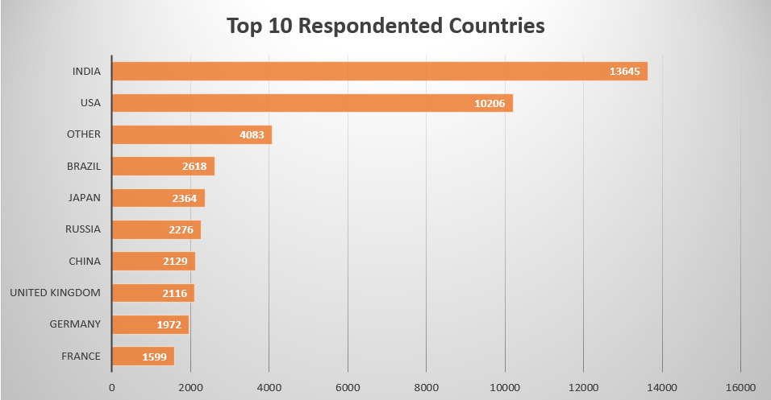
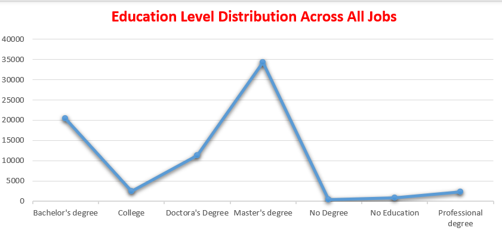
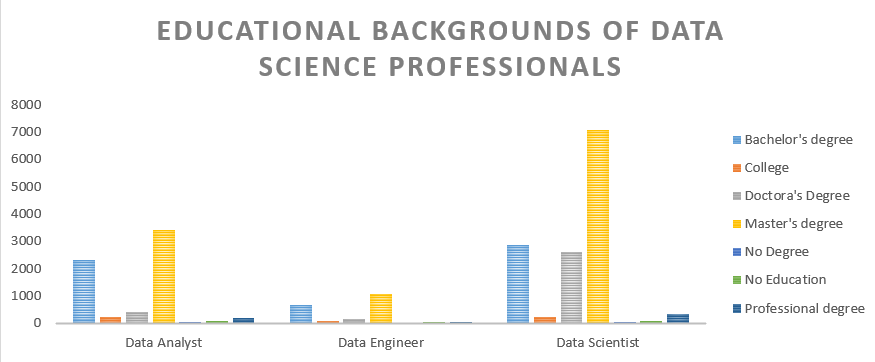
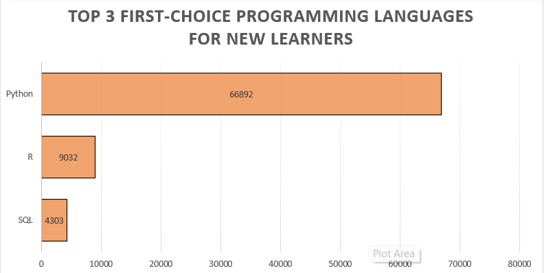
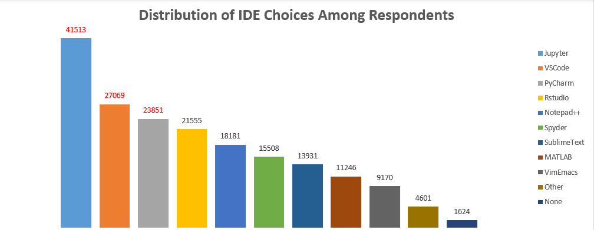
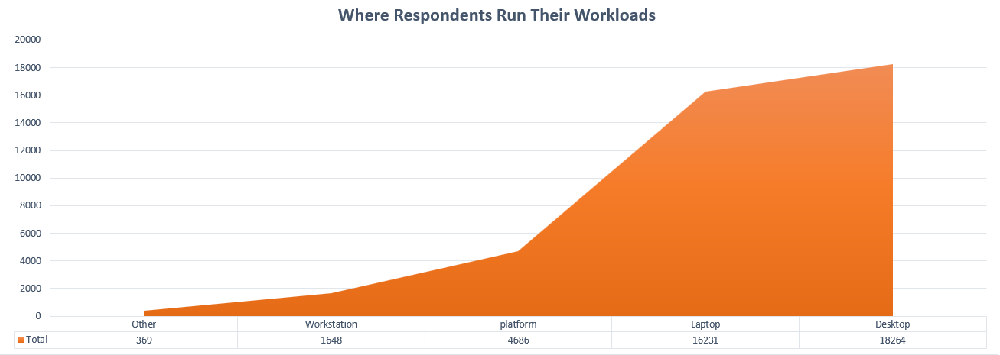
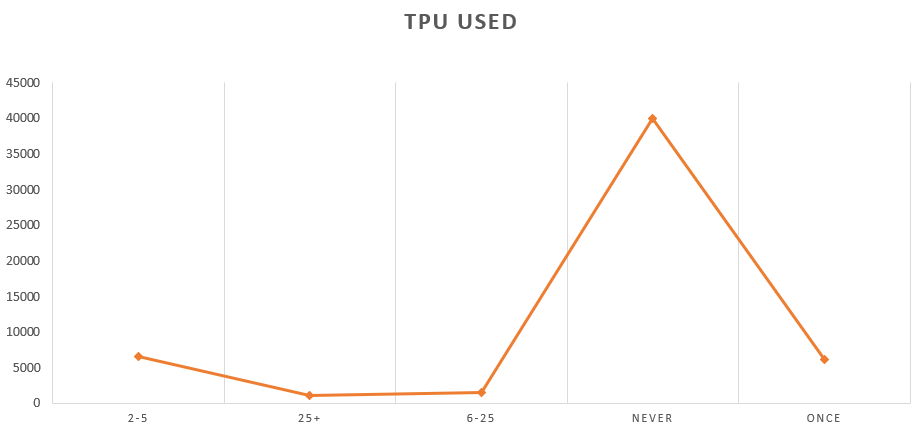
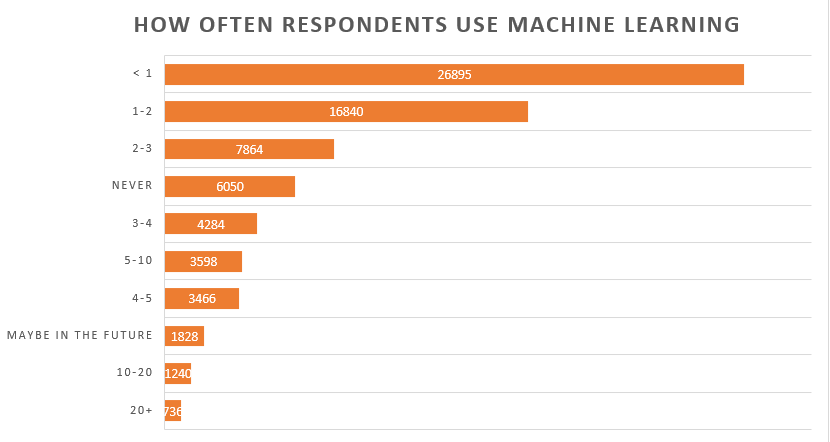

# 🗂️ Data Cleaning & Insight Generation from Survey Data

## 📖 Project Story

### 1. The Beginning

We started with the Kaggle Data Science & ML Survey (2017–2021) — a huge, messy, wide dataset that looked like a goldmine but needed serious preparation before any insights could be extracted.

**Goal:** Make the dataset clean, consistent, and analysis‑ready — then perform EDA on each cleaned block to extract meaningful insights.

### 2. The Data

**Source:** [Kaggle Data Science & ML Survey 2017–2021](https://www.kaggle.com/datasets/andradaolteanu/kaggle-data-science-survey-20172021)

**Original Rows:** 101,846 (after removing 4,456 duplicates)

**Original Columns:** ~293 before cleaning

**Format:**
- Multi‑choice → one column per option
- Single‑choice → one column per question

**Initial challenges:**
- Many blank/all‑null columns slowing Power Query & Excel
- Inconsistent naming (mixed casing, cryptic codes like Q1_Part_1)
- "None" / "Other" columns scattered in multiple formats
- Missing questions Q28–Q30 in source

### 3. Our Approach

1. Split the dataset into smaller files for speed and clarity.

2. Clean each file separately:
   - **Labeling** → for multi‑answer questions: Convert 0 to "Not Selected" and 1 to "Selected" for non‑technical stakeholders. Example: In Q7 (Programming Languages), 1 under "Lang: Python" = Selected, 0 = Not Selected.
   - **Mapping** → for single‑answer questions: map raw values to clear categories. Example: "United States of America" → "United States".
   - **Basic cleaning** → trim/remove extra spaces, fix casing, correct encoding issues.
   - **Data types** → set each field correctly (Text, Number, Date).

3. Export each cleaned file into an Excel workbook.

4. **EDA per sheet** — each cleaned sheet gets its own exploratory analysis to extract insights without slowing Excel by merging all data at once.

5. Document every change in simple, plain language so it's easy to follow and reproduce.

### 4. File Separation Plan

| File # | Contents |
|--------|----------|
| 1 | Demographics & General Questions (Q1–Q6) |
| 2 | Questions 7–15 |
| 3 | Questions 16–26 |
| 4 | Paired "Current vs Future" (Q27, Q32, Q34, Q36, Q37, Q38) — with Q28–Q30 missing |
| 5 | Q31, Q33, Q35, Q39–Q42 |

### 5. Special Handling for Paired Questions

In File 4:
- Each question has two versions — Current use and Future interest.
- Cleaned with mirrored naming (_Now / _Future) for clarity.

## 🚀 Cleaning Phase

[Sheet 1 — Demographic & General (Q1–Q6)](Excel_Sheets/Demographics%20&%20General%20Questions.xlsx)

**Actions Taken:**
- **Headers:** Renamed via mapping table; removed survey question text from first row.
- **Country:** Standardized spelling/casing.
- **Education:** Mapped to categories (Bachelor's, Master's, Doctoral, Professional, No education/degree, College).
- **Years Coding:** Normalized into ordered bands.
- **Career Stage:** Derived from age ranges → Junior, Mid, Senior, Expert.
- **Gender:** Standardized to "Male" / "Female" for binary analysis; original kept for reference.
- **Job Title:** Trimmed spaces, corrected casing, validated against role list.
- **Duration:** Converted seconds to rounded minutes; flagged extreme outliers.

# 📊 EDA

## Key Analyses Conducted

1. **Top 10 Respondent Countries**
   
   
   
   Ranked the countries with the highest number of survey participants, providing a clear view of the dataset's geographic concentration and primary respondent markets.
   

2. **Education Level Distribution Across All Jobs**

   
  
   Measured the spread of qualifications (e.g., High School, Bachelor's, Master's, PhD) across the entire job spectrum, capturing the global talent pipeline's education makeup.

3. **Educational Backgrounds of Data Science Professionals**  

 Focused specifically on respondents in data‑science‑related roles to uncover the academic paths most common in this field, from undergraduate majors to postgraduate specializations.

# 🔍 Analyze the Insights

- **Geographic Weighting**: The dataset is heavily influenced by a small set of countries that dominate the respondent pool. Strategic insights drawn from this survey will be most representative of these core markets.

- **Education Landscape**: The overall workforce skews towards higher education levels, with a strong representation of bachelor's and master's degree holders — but the proportion varies by country, hinting at differences in national education pipelines.

- **Data Science Talent Profile**: Data‑science professionals lean heavily toward advanced degrees, suggesting employers in this field may prioritize postgraduate qualifications or that such roles attract candidates with deeper academic backgrounds.

--------------------

[Sheet 2 — Questions 7–15](Excel_Sheets/Questions%207–15.xlsx)

**Summary:**
- **Headers:** Renamed via mapping table; survey text row removed.
- **Single‑answer columns (mapped):** mapped raw responses into clean categories.
- **Multi‑answer columns (labeled):**  — converted 0 to "Not Selected" and 1 to "Selected" for readability.

**CPU Column Issue (Simplified):**
- In the raw data, the "CPU" column came in blank for all rows.
- We traced it to an import mismatch where the column header didn't match the expected name, so Power Query pulled it in as null.
- **Fix:** Created a new column that correctly pulled CPU values from the right source field, replacing nulls where applicable.

# Exploratory Data Analysis & Insights 

## Q8 – Preferred Programming Language to Learn First

### EDA:
- Python overwhelmingly leads with **78.6%** of respondents recommending it as the first language to learn.
- R (10.6%) and SQL (5.1%) trail far behind.

### Insights:
- Python's dominance suggests it is perceived as the most versatile and accessible entry point for programming, especially in data science and analytics.
- R's niche appeal aligns with statistical and academic use cases, while SQL's lower ranking reflects its role as a complementary rather than primary language.
- Training programs and beginner resources should prioritize Python, with optional tracks for R and SQL.

## Q9 – Distribution of Preferred IDEs

### EDA:
- **Jupyter** leads with 41.5k selections, followed by **VS Code** (27.1k) and **PyCharm** (23.9k).
- RStudio (21.6k) and Notepad++ (18.2k) form the mid‑tier.
- Other IDEs have smaller but notable user bases.

### Insights:
- Jupyter's lead reflects its integration with Python and suitability for exploratory, notebook‑based workflows.
- VS Code's strong showing indicates a growing preference for lightweight, extensible editors.
- Tooling support and documentation should focus on Jupyter and VS Code, with PyCharm as a key secondary environment.

## Q11 – Primary Computing Platforms

### EDA:
- Desktop (18.3k) and laptop (16.2k) dominate usage.
- Other platforms (workstations, "Platform" category, and miscellaneous) are far less common.

### Insights:
- Development and deployment strategies should assume desktop/laptop as the primary environment.
- Optimization for less common platforms may have limited ROI unless targeting specialized user groups.

## Q13 – Frequency of TPU Using

### EDA:
- "Never" is the most common response (40k), followed by occasional participation (2–5 times: 6.5k; once: 6.2k).
- High‑frequency participation (>25 times) is rare.

### Insights:
- The activity has low penetration among respondents, suggesting either low awareness, low perceived value, or high barriers to entry.
- Engagement strategies should focus on converting "Never" respondents into occasional participants through awareness campaigns or low‑commitment entry points.

## Q15 – Frequency of Machine Learning Usage

### EDA:
- Most respondents use ML infrequently: <1 time (26.9k) or 1–2 times (16.8k).
- A significant group (6.0k) has never used ML.
- Heavy users (10+ times) are a small minority.

### Insights:
- ML adoption is still in early stages for the majority, with a long tail of occasional users.
- Training and tooling should target the "low‑frequency" segment to accelerate adoption.
- Advanced ML resources should be reserved for the smaller, high‑engagement group.

---

## Executive Summary – Section Q8–Q15

- **Python is the clear entry point** for programming, recommended by nearly 4 out of 5 respondents, with R and SQL far behind. This reinforces a Python‑first training and onboarding strategy.

- **Jupyter and VS Code dominate the IDE landscape**, reflecting a preference for flexible, lightweight, and Python‑friendly environments. PyCharm remains a strong third choice for more structured development.

- **Desktop and laptop usage is near‑universal**, simplifying environment standardization and reducing the need for platform‑specific adaptations.

- **Engagement gaps are evident** in both Q13 and Q15: large "Never" or "Low‑frequency" segments highlight untapped potential for participation in the surveyed activities and for machine learning adoption.

- **Adoption strategies should focus on conversion**, moving low‑engagement respondents into occasional or regular users through targeted awareness, accessible resources, and low‑barrier entry points.

  ### Sheet 3 — Questions 16–26

**File:** Excel\_Sheets/Questions 16–26.xlsx

**Actions Taken**

*   Headers normalized; survey‑text rows removed.
    
*   Applied the same mapping, labeling, data‑type enforcement, and cleaning techniques described for Sheet 1 (no repetition here).
    
*   Multi‑answer columns labeled for readability; original binaries preserved for reproducibility.
    
*   Rare categories collapsed to **Other** when frequency < 0.5%; missing indicators standardized to null; explicit flags added where applicable.
    
*   Exported cleaned sheet as a separate workbook for targeted EDA.
    

### Exploratory Data Analysis & Insights

**Findings by question group**

#### Q16 Frameworks

-   Counts: Scikit‑Learn (45,876); TensorFlow (32,108); Keras (28,059); XGBoost (19,723); PyTorch (17,515).

-   Insight: audience is split between classical ML (Scikit‑Learn, XGBoost) and deep learning (TensorFlow/Keras, PyTorch).

#### Q18 Computer Vision (CV)

-   Counts (excludes "None"): Classification 11,072; GeneralTools 7,008; Segmentation 6,804.

-   Insight: Classification has highest ROI potential; GeneralTools (preprocessing, augmentation, eval) improves reuse; Segmentation demands higher‑value.

#### Q19 Natural Language Processing (NLP)

-   Counts: Embeddings 6,868; Seq2Seq 4,905; Contextual 1,867; OTHER 240.

-   Insight: representation and retrieval workflows dominate; generation workflows are significant; contextual models are less common and are a next step for advanced teams.

#### Q24 Work activities

-   Counts: AnalyzeData 31,152; PrototypeML 21,371; BuildInfra 16,661; RunMLService 15,248; ResearchML 12,792; ImproveModels 10,798; OTHER 2,640.

-   Insight: analysis and prototyping are most frequent; fewer respondents complete production and iterative improvement.

#### Q20--Q23, Q25--Q26  (summary of provided numerical analyses)

-   **CompanySize × Employer_UsesML heatmap** : Enterprise (10,000+) shows highest Established ML (~37.6%); Large and Medium show strong Exploratory shares; Small and Micro show high Exploratory and No ML.

-   **Staff & Compensation**: larger teams have more mid/high compensation; Solo and Small concentrate in 0--50K band (Solo ~78% in 0--50K).

-   **ML Spend × CompanySize**: Enterprise drives the top spend band ($100k+) with 46.3% in that band; Micro and Small show the highest $0 and $1--$99 shares.

-   Insight: maturity and budget scale with company size; the conversion funnel from exploratory to production is the primary growth opportunity; mid‑spend bands ($1k--$99k) are best for paid pilots.

### Simple  summaries

-   "Scikit‑Learn is the most used framework; prioritize Scikit‑Learn and TensorFlow/Keras training and templates."

-   "Classification and Embeddings are the highest‑value deliverables for CV and NLP respectively."

-   "Enterprise companies hold most ML budget; target them with enterprise SLAs and high‑touch pilots."

-   "Medium and Large firms are the best candidates for paid pilots; Small and Micro need low‑friction starter kits."

### Sheet 4 — Paired Current vs Future (Q27, Q32, Q34, Q36, Q37, Q38)

**File:** Excel\_Sheets/Paired\_Current\_vs\_Future.xlsx

**Actions Taken**

*   Headers normalized to mirrored naming (\_Now / \_Future); Respondent\_ID ensured and deduplicated.
    
*   Applied the same mapping, labeling, data‑type enforcement, and cleaning techniques described for Sheet 1 (no repetition here).
    
*   Harmonized vocabulary across pairs; created explicit 0/1 binary flags per choice per side including **None** and **Other**.
    
*   Ordinal items coded where present; added **delta** (Future – Current) and **Direction** (1 = increase, 0 = no change, -1 = decrease); audit table created for unmapped values.
    

**Links**

*   Cleaned paired sheet: \[LINK\_TO\_SHEET\_4\_GOES\_HERE\]
    

**Exploratory Data Analysis & Insights**

*   Per‑choice deltas (top gainers and losers): (insert numeric delta table highlights and interpretation here)
    
*   Direction distribution summary: (insert counts for increase / no change / decrease)
    
*   Demographic segments with highest positive adoption intent: (insert top countries / career stages and percentages)
    

**Notes for insertion**

*   Replace \[LINK\_TO\_SHEET\_4\_GOES\_HERE\] with the repo path or file link.
    
*   Paste your real delta numbers, direction counts, and segment percentages into the EDA bullets.
    

### Sheet 5 — Questions 31, 33, 35, 39–42

**File:** Excel\_Sheets/Questions 31\_33\_35\_39–42.xlsx

**Actions Taken**

*   Headers standardized and question header row removed.
    
*   Applied the same mapping, labeling, data‑type enforcement, and cleaning techniques described for Sheet 1 (no repetition here).
    
*   Single‑answer mappings documented with raw values preserved in \_raw columns; scale normalizations stored centrally.
    
*   Derived indicators (e.g., **Active\_ML\_User**, **Cloud\_Adopter**) created; range and logic checks applied and anomalies flagged.
    

**Links**

*   Cleaned sheet: \[LINK\_TO\_SHEET\_5\_GOES\_HERE\]
    

**Exploratory Data Analysis & Insights**

*   Frequency and intensity summaries (top counts and percentages): (insert numbers and concise interpretation here)
    
*   Correlations with tools and demographics predicting heavy ML use: (insert correlation highlights and numeric strength)
    
*   List of validation anomalies found and action taken: (insert counts and short notes)
    

**Notes for insertion**

*   Replace \[LINK\_TO\_SHEET\_5\_GOES\_HERE\] with the repo path or file link.
    
*   Paste your real EDA numbers, correlation strengths, and anomaly counts into the EDA bullets.

