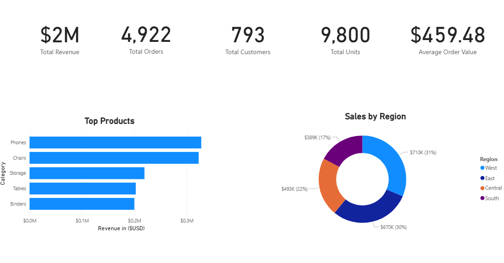
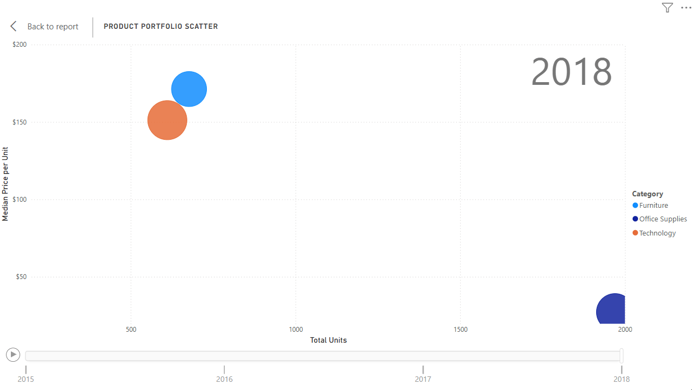

# 📊 Superstore Sales Analytics: A Power BI Deep Dive  

  

---
## 🎯 Executive Summary  
What started as a messy Superstore dataset has become a powerful analytical dashboard that reveals the hidden patterns driving **$2,261,537 in revenue**. Through carefully crafted visualizations, we've uncovered critical insights:
- **Consumers dominate our revenue stream ($1.15M, 50.76%)**  
- **Shipping preferences reveal untapped pricing opportunities (Corporate Same Day $45,121)**  
- **Regional and product-level analysis highlights concentration risks and growth opportunities**  
- **Product portfolio scatter shows how pricing and unit volumes evolved from 2015–2018**  

---

## 📌 Page 1: Executive KPIs, Regional & Product Insights  
[Raw Data](Sheets/RawData.xlsx)  
[Cleaned Data](Sheets/CleanedData.xlsx)  
[Power BI File](Sheets/Task.pbix)  

---
 

---

**Overview of key performance metrics**

| Metric              | Value               |
|---------------------|---------------------|
| **Total Revenue**   | **$2,261,537**      |
| **Total Orders**    | 4,922               |
| **Total Customers** | 793                 |
| **Total Units Sold**| 9,800               |
| **Average Order Value (AOV)** | **$459.48** |

---

### 🌍 Sales by Region
| Region   | Total Revenue |
|----------|---------------|
| **West** | **$710,220**  |
| East     | $669,519      |
| Central  | $492,647      |
| South    | $389,151      |

> 🔎 **Highlight:** The **West region leads with $710,220**, while the **South lags at $389,151** — a clear opportunity for targeted campaigns.

---

### 🏆 Top Products
| Product   | Revenue |
|-----------|---------|
| **Phones** | **$327,782** |
| Chairs    | $322,823 |
| Storage   | $219,343 |
| Tables    | $202,811 |
| Binders   | $200,029 |

> 🔎 **Highlight:** **Phones ($327,782)** and **Chairs ($322,823)** are the top revenue drivers, together contributing nearly $650,000.

[Top Products](Sheets/Top%20Products.csv)  
[Sales by Region](Sheets/Sales%20by%20Region.csv)  

---

## 📌 Page 2: Customer Segment Deep Dive  
**Understanding who our customers are and how they behave across segments and shipping preferences**

  

---
### 📊 Segment Revenue Breakdown
| Segment       | Revenue     | Percentage | Units Sold | AOV      | Customers |
|---------------|-------------|------------|------------|----------|-----------|
| **Consumer**  | **$1,148,061** | 50.76% | 5,101 | $452.53 | 409 |
| Corporate     | $688,494    | 30.44% | 2,953 | $461.77 | 236 |
| Home Office   | $424,982    | 18.79% | 1,746 | **$475.37** | 148 |
| **Total**     | $2,261,537  | 100%   | 9,800 | $459.48 | 793 |

> 🔎 **Highlight:** Consumers generate **over half of total revenue ($1.15M)**, while **Home Office customers have the highest AOV ($475.37)**.

---

### 📊 Ship Mode Preference by Segment
| Ship Mode      | Total Revenue | Consumer     | Corporate    | Home Office  |
|----------------|---------------|--------------|--------------|--------------|
| **Standard Class** | **$1,340,831** | $702,378 | $401,747 | $236,706 |
| Second Class   | $449,914      | $230,126     | $139,045     | $80,743      |
| First Class    | $345,572      | $158,105     | $102,580     | $84,887      |
| Same Day       | $125,218      | $57,452      | **$45,121**  | $22,645      |

---

### 🔎 Insights
- **Standard Class dominates:** $1.34M (59% of total revenue). Most customers prefer cheaper, slower shipping.  
- **Corporate customers stand out in Same Day:** They spend **$45,121 on Same Day**, which is **36% of all Same Day revenue**, despite being only 30% of overall revenue. 👉 This shows willingness to pay for speed, a niche upsell opportunity.  
- **Consumers:** Largest spenders overall, but their Same Day spend is only **$57,452 (18% of their total shipping spend)**. They prefer Standard Class.  
- **Home Office:** Balanced across shipping modes, but their **First Class spend ($84,887)** is relatively high compared to their size.  

---

### 🧠 Why This Matters
- **Consumers ($1.15M)** → Mass campaigns, discounts, loyalty programs.  
- **Home Office (highest AOV $475.37)** → Premium bundles, personalized offers.  
- **Corporate (Same Day $45,121)** → Upsell express delivery, premium shipping packages.  

---

### ✅ Key Numbers to Spotlight
- **$1,148,061** → Consumer revenue (largest segment).  
- **$475.37** → Home Office AOV (highest per order).  
- **$45,121** → Corporate Same Day spend (disproportionately high).  
- **$1,340,831** → Standard Class revenue (dominant shipping mode).  

[Segment Details](Sheets/Segment%20Details.csv)  
[Ship-Mode Preference](Sheets/Ship-Mode%20Preference.csv)  
[Revenue by Customer Segment](Sheets/Revenue%20by%20Customer%20Segment.csv)  

---

## 📌 Page 3: Product Portfolio Scatter  
**Analyzing product pricing and performance across categories from 2015 to 2018**

  

---
### 📈 Tooltip-Driven Metrics
| Year | Category        | Revenue     | Units Sold | Median Price |
|------|-----------------|-------------|------------|--------------|
| 2015 | Furniture       | $156,478    | 414        | $182.86      |
| 2015 | Office Supplies | $149,513    | 1,192      | $25.54       |
| 2015 | Technology      | $173,866    | 347        | $199.98      |
| 2016 | Furniture       | $164,054    | 440        | $191.67      |
| 2016 | Office Supplies | $133,124    | 1,210      | $27.22       |
| 2016 | Technology      | $162,258    | 405        | $199.96      |
| 2017 | Furniture       | $195,813    | 547        | $187.06      |
| 2017 | Office Supplies | $182,418    | 1,537      | $29.72       |
| 2017 | Technology      | $221,962    | 450        | $166.44      |
| 2018 | Furniture       | $212,314    | 677        | $171.29      |
| 2018 | Office Supplies | **$240,368** | **1,970** | $27.16       |
| 2018 | Technology      | **$269,371** | 611        | $151.19      |

---

  

---
### 📊 Supporting KPIs
- **Average Price per Unit:** $230.77  
- **Median Price per Unit:** **$54.49**  

> 🔎 **Highlight:** Median price ($54.49) is far lower than the average ($230.77), showing skew from high-ticket items like copiers and machines.

---

### 🧠 Analytical Highlights  
- **Office Supplies (2018):** Highest unit volume (**1,970**) but low median price ($27.16) → volume-driven growth.  
- **Technology (2018):** Highest revenue (**$269,371**) despite fewer units (611) → premium pricing power.  
- **Furniture:** Consistent growth, reaching **$212,314** in 2018 → stable category for margin optimization.  

[Revenue by Category & Year](Sheets/RevenueByCategory%26Year.csv)  
[Product Portfolio Scatter](Sheets/Product%20Portfolio%20Scatter.csv)  

---

### 📌 Recommendations  
- **Boost Office Supplies efficiency:** Focus on inventory and promotions to capitalize on high unit sales (**1,970 units in 2018**).  
- **Leverage Technology’s premium appeal:** Maintain pricing discipline and bundle accessories with high-ticket items (**$269,371 revenue in 2018**).  
- **Optimize Furniture margins:** Stable growth to **$212,314 in 2018** suggests potential for targeted upselling and premium product lines.  
- **Balance pricing strategy:** Use **median price ($54.49)** as a reliable benchmark instead of skewed averages.  
- **Regional targeting:** Expand campaigns in the **South ($389,151)** to close the gap with the West ($710,220).  
- **Product focus:** Double down on **Phones ($327,782)** and **Chairs ($322,823)** as flagship revenue drivers.  

---
